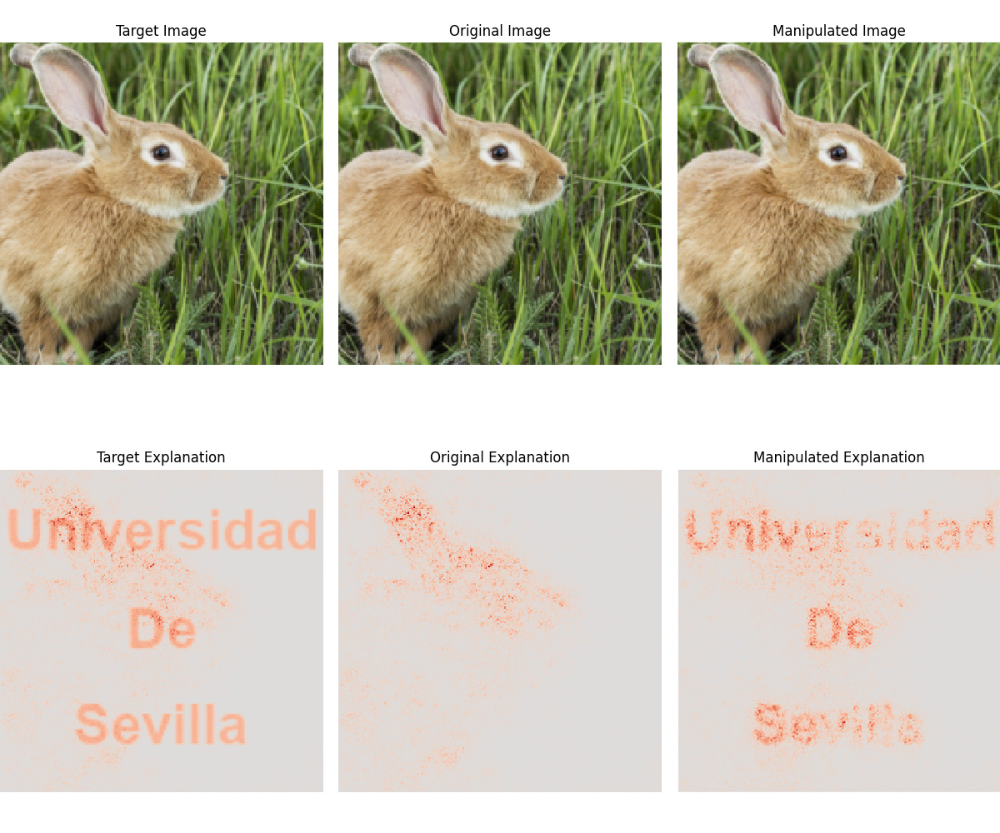
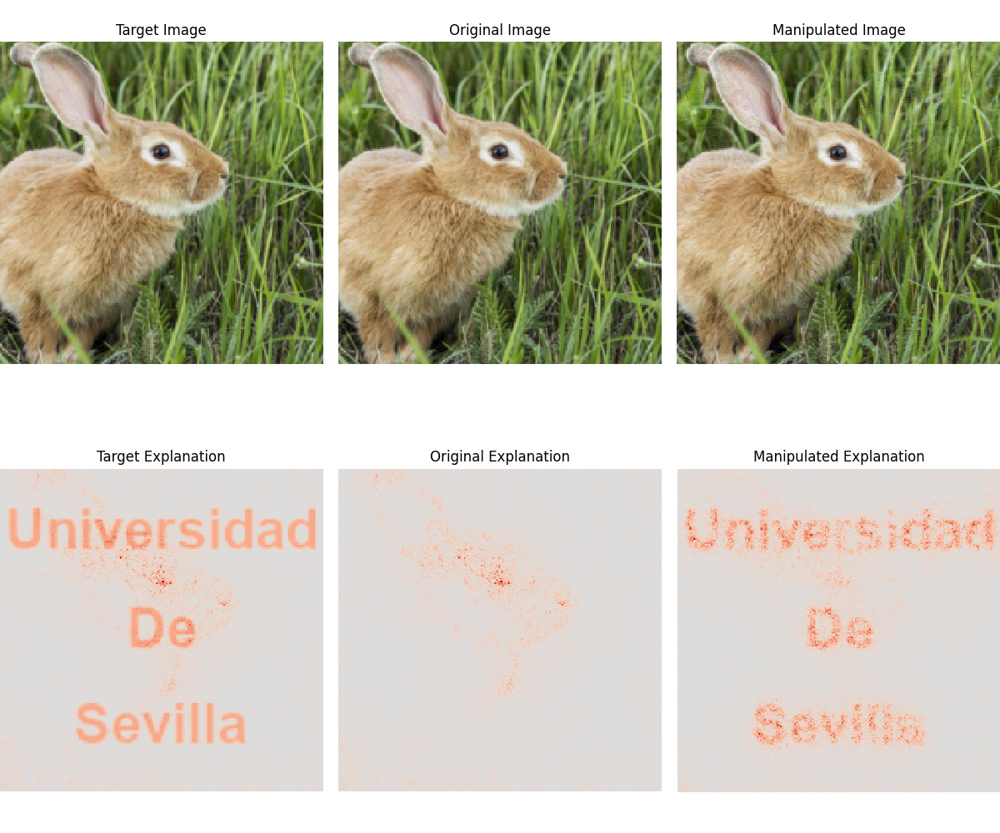
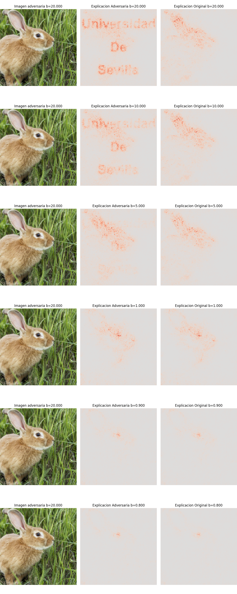
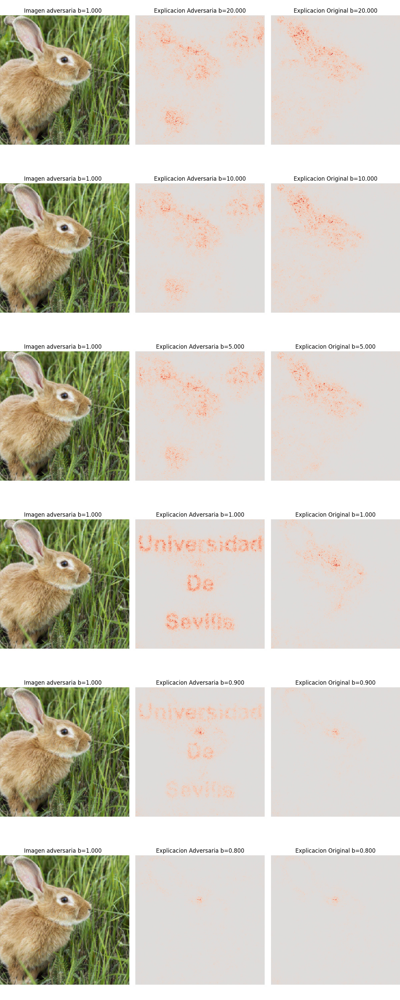
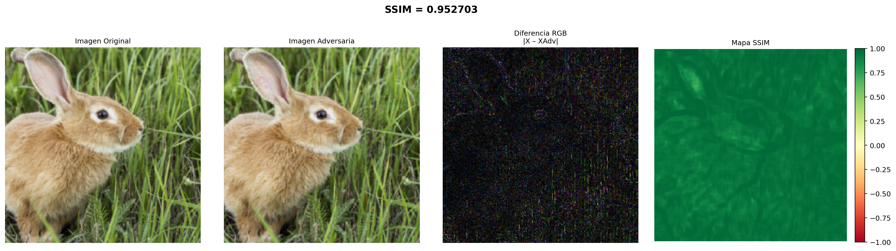

# Robustez de métodos de explicabilidad frente a ataques adversarios

Este repositorio contiene el código y los experimentos de mi Trabajo Fin de Máster (MULCIA, Universidad de Sevilla) sobre la **manipulación de explicaciones en redes neuronales profundas** y el estudio de la **robustez de los métodos de explicabilidad** frente a ataques adversarios, inspirado en el trabajo de Pan Kessel *“Explanations can be manipulated and geometry is to blame”*.

El objetivo principal es analizar cómo, manteniendo la predicción de la red, es posible alterar significativamente el mapa de calor asociado a la explicación, y cómo influye el parámetro de suavizado \( \beta \) en dicha robustez.

---

## 1. Estructura del repositorio

```text
TFM/
├── README.md
├── codigo/
│   ├── run_attack-beta.py
│   ├── run_attack-multiples-betas.py
│   ├── ssim_compare.py
│   └── utils_modificado.py
│       
└── imagenes
```

- `codigo/`: scripts para lanzar ataques y análisis (ataque con β fijo, barridos de β, comparación SSIM).   
- `imagenes/`: resultados por experimento.  

---

## 2. Scripts principales

### 2.1 `run_attack-beta.py`

Ejecuta un **ataque adversario sobre el mapa de explicaciones usando una única imagen**:

- Genera el mapa de calor original \( h(x) \) y un mapa objetivo \(\tilde{h}(x)\) añadiendo el texto “Universidad De Sevilla” mediante `get_expl_with_text`.  
- Optimiza una imagen adversaria \( x_{\text{adv}} \) para que su explicación se parezca a \(\tilde{h}(x)\) mientras mantiene la predicción original de la red.  
- Permite fijar un valor concreto de \( \beta \) en las activaciones `softplus` mediante los parámetros `--beta_growth` y `--beta_value`.  
- Genera una figura de resumen con imagen original, mapa objetivo y mapa adversario, así como la imagen adversaria desnormalizada y un fichero de métricas (MSE, MAE). [file:66]

Uso típico:

```bash
cd src
python run_attack-beta.py \
  --img ../conejo.jpg \
  --cuda \
  --beta_growth \
  --beta_value 20.0 \
  --method gradient \
  --output_dir ..
```

### 2.2 `run_attack-multiples-betas.py`

Extiende el ataque anterior para estudiar de forma sistemática la **robustez de las explicaciones frente a distintos valores de \( \beta \)**:

- Ejecuta el ataque adversario usando un valor inicial de \( \beta \).  
- Una vez obtenida \( x_{\text{adv}} \), evalúa las explicaciones adversaria y original para una lista de valores \( \beta \in \{20, 10, 5, 1, 0.9, 0.8\} \) (o un rango definido por el usuario).  
- Usa la función `plot_overview_grid` de `utils_modificado` para generar una figura en forma de rejilla, con N filas (un valor de β por fila) y 3 columnas: imagen adversaria, explicación adversaria y explicación original. [file:67][file:69]  
- Guarda la imagen adversaria desnormalizada y un fichero de texto con predicciones y métricas (MSE, MAE, pérdida de explicabilidad final).

Ejemplo:

```bash
cd src
python run_attack-multiples-betas.py \
  --img ../conejo.jpg \
  --cuda \
  --num_iter_max 1500 \
  --loss_dif 9e-10 \
  --method gradient \
  --output_dir ..
```

### 2.3 `utils_modificado.py`

Conjunto de utilidades adaptadas del archivo `utils.py` del repositorio original `adv_explanation_ref`:

- `plot_overview`: versión extendida para visualizar imágenes y mapas de calor junto a métricas (MSE entre imágenes y entre explicaciones).  
- `plot_overview_grid`: visualización específica para barridos de \( \beta \), con filas para cada valor de \( \beta \) y columnas para imagen adversaria, explicación adversaria y explicación original.  
- `load_image`: carga de imágenes con tratamiento específico para PNG, garantizando conversión a RGB y preprocesado estilo ImageNet (resize 256, center crop 224, normalización).  
- `get_expl_with_text`: variante de generación de explicaciones que superpone el texto “Universidad De Sevilla” sobre el mapa de calor antes del colapso de canales, controlando la intensidad mediante un factor configurable. [file:69]

### 2.4 `ssim_compare.py`

Script auxiliar para **comparar imagen original y adversaria** mediante el índice SSIM:

- Carga dos imágenes, las redimensiona al mismo tamaño y calcula el SSIM multicanal.  
- Genera una figura con 4 paneles: imagen original, imagen adversaria, diferencia RGB amplificada y mapa SSIM promedio de los tres canales, con el valor global de SSIM en el título. [file:68]

Uso:

```bash
cd src
python ssim_compare.py \
  ../Conejo_original.jpg \
  ../Conejo_adv_b-20.jpg \
  ../ssim_comparison_b-20.png
```

---

## 3. Entorno y dependencias

Las principales dependencias se listan en `requirements.txt`. A grandes rasgos:

- Python 3.[X]  
- `torch`, `torchvision`  
- `pytorch-msssim` (para SSIM tensorial)  
- `numpy`, `matplotlib`, `Pillow`  
- `scikit-image` (para SSIM sobre imágenes RGB en `ssim_compare.py`) 

Creación de entorno recomendado:

```bash
python -m venv .venv
source .venv/bin/activate   # en Windows: .venv\Scripts\activate
pip install -r requirements.txt
```

---

## 4. Cómo reproducir los experimentos

### 4.1 Generación de un ejemplo adversario con β fijo

1. Colocar la imagen original en `data/original/` (por ejemplo `conejo.jpg`).  
2. Ejecutar `run_attack-beta.py` indicando el valor de β y el método de explicabilidad:

```bash
python src/run_attack-beta.py \
  --img data/original/conejo.jpg \
  --num_iter 1000 \
  --img Conejo.jpg \
  --cuda \
  --beta_growth \
  --beta_value 0.8 \
  --method gradient \
  --output_dir experiments/single_beta/
```

     

3. El script generará:
   - Una imagen adversaria en `experiments/single_beta/`.  
   - Una figura de overview (`overview_...png`).  
   - Un fichero `resultados_*.txt` con predicciones y métricas (MSE, MAE, etc.).

### 4.2 Análisis de robustez variando β

1. Ejecutar `run_attack-multiples-betas.py` indicando el valor de β objetivo, el rango de β y el método de explicabilidad:

```bash
python src/run_attack-multiples-betas.py \
  --num_iter_max 3000 \
  --loss_dif 9.99999e-10 \
  --img Conejo.jpg \
  --cuda \
  --beta_growth \
  --beta_target 20 \
  --beta_range 40 20 10 5 1 0.9 0.8 \
  --method gradient \
  --output_dir experiments/multi_beta/
```
      

2. El script:
   - Construye un rango de β (por defecto `[20.0, 10.0, 5.0, 1.0, 0.9, 0.8]`).  
   - Evalúa explicaciones adversaria y original para cada β.  
   - Genera una figura de rejilla (`overview_Beta_proof_...png`) donde cada fila corresponde a un valor de β.

### 4.3 Comparación estructural (SSIM) entre imagen original y adversaria

Usar `ssim_compare.py` para visualizar diferencias y el valor global de SSIM:

```bash
python ../ssim_compare.py \
  figures/gradients/Conejo_original.jpg \
  figures/gradients/Conejo_gradiente_b-20-6.jpg \
  imagenes/ssim_comparison_b-20-8.jpg
```

El resultado es una figura con SSIM global en el título, diferencia RGB ampliada y mapa SSIM por píxel.

---

## 5. Resultados experimentales (figuras)

En esta sección se muestran algunas de las figuras clave generadas en el TFM. Las rutas asumen que has colocado las imágenes en la carpeta `imagenes/` como se indica al principio (ajusta la ruta si usas otra).

### 5.1 Gradientes con texto superpuesto para distintos β

#### β alto vs β bajo (visión global de la manipulación)


<p align="center">
  
  &nbsp;&nbsp;
  
</p>
<p align="center"><em>Izquierda: β = 20.0 &nbsp;|&nbsp; Derecha: β = 1.0</em></p>


### 5.2 Barrido de β: imagen adversaria fija, explicaciones adversaria y original

Aquí se muestran dos rejillas:  
- En la primera, la **imagen adversaria** se mantiene fija y se visualizan las explicaciones adversaria y original para distintos β cuando el texto aparece con alta intensidad (ataque fuerte).  
- En la segunda, el ataque está más limitado y se observa en qué rangos de β el texto “Universidad De Sevilla” sigue siendo visible en la explicación.


<p align="center">
  
  &nbsp;&nbsp;
  
</p>
<p align="center"><em>Izquierda: Ataque para β = 20.0 &nbsp;|&nbsp; Derecha: Ataque para β = 1.0</em></p>


Cada figura se interpreta fila a fila:
- Columna 1: imagen adversaria \( x_{\text{adv}} \) (igual en todas las filas).  
- Columna 2: explicación adversaria para un valor de β concreto.  
- Columna 3: explicación original para ese mismo valor de β.

### 5.3 Comparaciones SSIM entre imagen original y adversaria

Las siguientes figuras muestran comparaciones cuantitativas mediante SSIM:


<p align="center">
  
  
</p>
<p align="center">
<em>SSIM = 0.976 — Ataque con β = 20.0</em>
</p>

<p align="center">
  
  
</p>
<p align="center">
<em>SSIM = 0.952 — Ataque con β = 1.0</em>
</p>


Cada figura contiene:
- Imagen original.  
- Imagen adversaria.  
- Diferencia RGB amplificada |X − X_adv| × 5.  
- Mapa SSIM por píxel (promedio de los 3 canales), junto con el valor global de SSIM.

---

## 6. Créditos y licencia

El código de este repositorio se basa en el trabajo de Pan Kessel,
**"Explanations can be manipulated and geometry is to blame"**, disponible en:

> [https://github.com/pankessel/adv_explanation_ref](https://github.com/pankessel/adv_explanation_ref)

Los archivos `run_attack-beta.py`, `run_attack-multiples-betas.py` y `utils_modificado.py`
incluyen cabeceras con la licencia original Apache 2.0 y las modificaciones específicas
realizadas para este TFM.

Las imágenes de muestra utilizadas en los experimentos (conejo) han sido obtenidas de
[Freepik](https://www.freepik.com) bajo su licencia gratuita. Se requiere atribución:
> Imagen de [Freepik](https://www.freepik.com)

---
